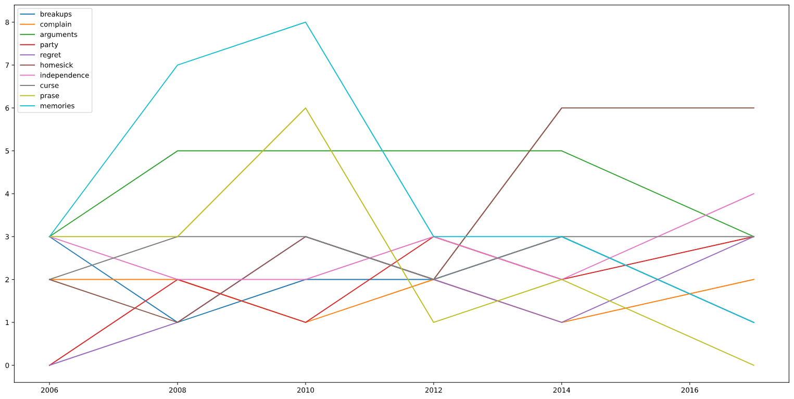

# Taylor Swift Song Lyrics Analysis with NLTK

Scooping around Taylor Swift song lyrics.

## Getting Started

This is the purpose of tracking my study record in the field of data science. Therefore, I edited some examples from CodeAcademy for demonstration purposes.

The refernce source: <https://news.codecademy.com/song-lyric-topic-analysis-live/>
The reference vedio: <https://www.youtube.com/watch?v=wKW8z6zqCFo&t=19s>

### Prerequisites

The environment setting is a bit different from the video.
The following is a description of my setting environment.
Due to Microsoft Visual Studio Code has integrated with Jupyter Notebook, I would use it as my main editor for simplicity reason.

- Operating Systsm
  - Linux Mint 20
- Editor
  - Microsoft Visal Studio Code, a.k.a. MS VScode
- Software
  - Miniconda
  - Python3

The following is the used packages in Python3:

```Python3
- pip3
- pandas
- sklearn
- Nature Language Took Kit, NLTK
- matplotlib
```

### Installing

A step by step series of examples that tell you how to get a development env running

Step 1. Check your computer have the "Jupyter package".

```Command Line
pip install jupyter
```

Step 2. Install Miniconda
Step 2.1. Download the installer from offical webiste [Miniconda Download Installer](https://docs.conda.io/en/latest/miniconda.html#linux-installers).


Step 2.2. Run predeifind script from the Miniconda Download Installer in Step 2.1.

```CMD
bash Miniconda3-latest-Linux-x86_64.sh
```

Step 2.3. Follow the promts on the terminal.

Step 2.4. Close the terminal.

Step 2.5. Open a new terminal and run the following command to verify that your install is successful.

```CMD
conda --version
```

or

```CMD
conda list
```

Note: If you want update the packages in the Miniconda, run the update command which comes along with Miniconda.

```CMD
conda update conda
```

For the further applications and information, please visit [Miniconda documantation website](https://docs.conda.io/projects/conda/en/latest/index.html)

Step3. Back to MS VScode, select the proper interpreter for python. [Detals about Jupyter Notebook](https://code.visualstudio.com/docs/python/jupyter-support)

> You are now finish the setup and stating to having fun with analyzing the lyrics.

## Code Explain

The code has been added to the file "lyrics_play.ipynb".

## Analyzed reuslt


## Deployment

In order to operate the environment properly, the interpreter is critical for selection. Besides, it is important to apply vitrual environment (e.g. venv) during the developing process, by doing this your all work will be able to running anywhere while Python is installed.

## Built With

* [Microsoft Visual Studio Code](https://code.visualstudio.com/) - The IDE which I used.
* [Python3](https://www.python.org/) - The language That I use.
* [Jupyter NoteBook](https://pypi.org/project/jupyter/) - For interactive Jupyter Notebook in MS Visual Studio Code.
* [Natural Language Toolkit](https://www.nltk.org/) - To enabling our ability to work with words and lyrics.
* [MiniConda] (https://docs.conda.io/en/latest/miniconda.html)

## Acknowledgments

* Lyric Source: (Kaggle)[https://www.kaggle.com/PromptCloudHQ/taylor-swift-song-lyrics-from-all-the-albums/tasks]

* Special Thanks to:

  - How I install Miniconda on Linux Mint [Tom Ordonez](https://www.tomordonez.com/install-miniconda-linux/)

  - Original Website [Minicodna](https://docs.conda.io/projects/conda/en/latest/user-guide/install/linux.html)

  - Codecadamy Live Broadcast [Codecademy](https://news.codecademy.com/song-lyric-topic-analysis-live/)

  - Microsoft Visual Studio Code with Jupyter Notebook integration [MS VScode with Jupyter Notebook](https://code.visualstudio.com/docs/python/jupyter-support)